# 3D-printed eyeglasses
### Version 1.3

Those are the CAD files for the frames of the spectacles I wear every day. When I break the frames, or if I want a new color for a bit of diversity, I simply print new frames and reuse the lenses.

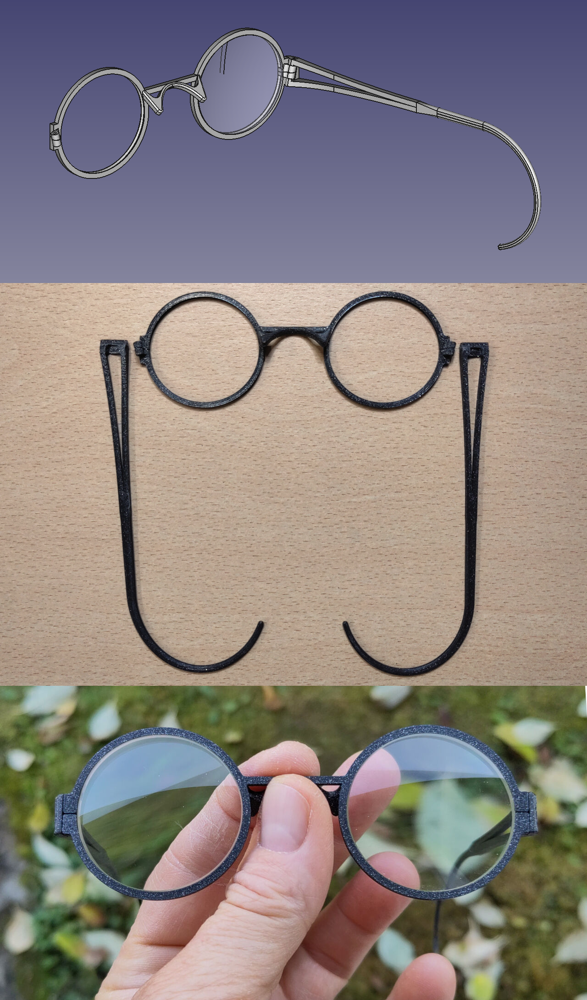

* [Files](#Files)
* [Explanation of the registration tabs](#Explanation-of-the-registration-tabs)
* [Printing](#Printing)
* [Ordering lenses](#Ordering-lenses)
* [Assembly](#Assembly)
* [Customizing](#Customizing)
* [Custom case](#Custom-case)
* [Clip-on shades for round 38.8mm-diameter lenses](#Clip-on-shades-for-round-38.8mm-diameter-lenses)
* [Clip-on shades with novelty mesh lenses](#Clip-on-shades-with-novelty-mesh-lenses)
* [Custom case for the clip-on shades](#Custom-case-for-the-clip-on-shades)

## Files

### Frames proper

Final frames in which the lenses are mounted. The lens holders feature lens registration tabs in the V-grooves at the split hinges (see below).

- [FreeCAD model for the frame](frame.FCStd)
- [3MF model for the frame](frame.3mf)

- [FreeCAD model for the right temple](right_temple.FCStd) (the left temple is the mirror)
- [3MF model for the right temple](right_temple.3mf) (the left temple is the mirror)

### Template for the lens manufacturer

This template is supplied to the lens manufacturer: the lens holders have the same geometry as the final frames but the template is square and stiffer to facilitate mounting in the [lens edging machine](https://youtu.be/dKXUWH8gQLU), the V-groove is slightly deeper than the V-groove in the final frames and the registration tabs are absent to avoid snagging on the edging machine's tracer.

- [FreeCAD model for the edging machine template](template_for_lens_edging_machine.FCStd)
- [3MF model for the edding machine template](template_for_lens_edging_machine.3mf)

- [FreeCAD model for the edging machine template's fake hinges' locking piece](template_for_lens_edging_machine-hinge_lock.FCStd) (2 needed per template)
- [3MF model for the edging machine template's fake hinges' locking piece](template_for_lens_edging_machine-hinge_lock.3mf) (2 needed per template)

### Optional hinge pin jig

Optionally, this jig can be printed to hold the frames at a 13° angle so that the hinges' axes are vertical, to drive the pins in or out of the hinges with a press.

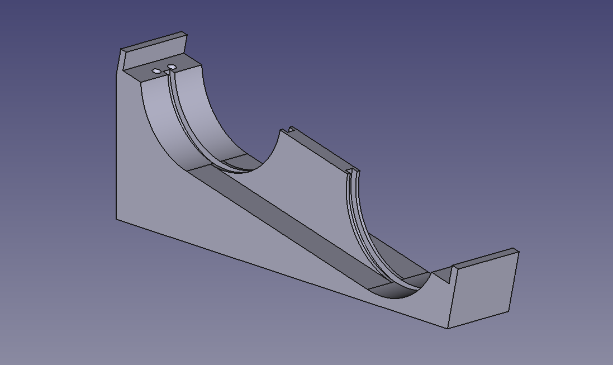

- [FreeCAD model for the hinge pin jig](hinge_pin_jig.FCStd)
- [3MF model for the hinge pin jig](hinge_pin_jig.3mf)

### Additional details for the lens manufacturer

A few details the lens manufacturer needs to choose the grinding wheel with the correct bevel profile ("hide-a-bevel"-type bevel, 120° angle) and the width and position of the lens registration tabs if you want them to file it for you - and they agree to do it of course:

## Explanation of the registration tabs

The final frames feature lens registration tabs around the split hinges that interrupt the V-grooves. Those tabs orient the lenses correctly, which is important for astigmat lenses particularly. In this frame design, they also help lock the frame closed.

The tabs are required because the lenses are almost round. They provide a positive mechanical stop to prevent the lenses from shifting and turning in the lens holders, but they require filing a 3.5mm-wide notch in the lenses' bevel.

This type of lens registration is almost never used in round glasses because the frame itself is usually made of a material strong enough to clamp the lenses solidly in place, or the lenses are glued in place. Also, they're difficult to manufacture with traditional machining methods.

Those 3D-printed glasses provide very little clamping force, and glue isn't ideal to routinely and quickly install the lenses into new frames without damaging them. But it's trivially easy to print the registration tabs inside the V-grooves with a 3D printer.

Notching the bevel of the lenses is a one-off job, so this registration solution is more desirable if you want to change frames often. But it does require a square needle file, and more importantly, being handy with one. And it does require a small vise with rubber jaws, covering the lenses with scotch tape to avoid scratching them when they're clamped in the vise, and working up the nerves to files through your brand new, multi-hundred-dollar lenses if your prescription is very special.

If you don't think you can do it, point your lens manufacturer or your local optician to this page and ask them if they can do it for you. The lens manufacturer probably won't have time for this, but your local optician most certainly will if you order through them - but for a price of course. But again, it's a one-off job and after that, your new frames will always be free and you'll be able to mount the lenses yourself at home in a couple of minutes 🙂

## Printing

You can print the frames in any material you want, even PLA. Prefer low layer heights and print at lower speeds to get better details and more accuracy for the hinge pin holes and the V-groove profile. 0.2mm works, but 0.15mm or even 0.10mm is better. Print the lens holder front face down and the temples outer face down, so the visible surfaces when you wear the glasses look the smoothest and nicest.

## Ordering lenses

- Print the template and 2 fake hinge locking pieces.
- Split the hinges with an X-Acto knife or a razor blade.
- Close each hinge with a locking piece and secure it with a small piece of 1mm piano wire or similar.
- Send the template to the lens manufacturer or give it to your optician along with your prescription and tell them you want to receive the lenses mounted with the proper orientation in the lens holders with the 3 alignment dots marked on each lens! This is very important if you want to notch the bevels yourself. Otherwise ask the lens manufacturer or the optician to do it for you: they'll know what to do.

## Notching the lenses

- Insert the lenses in the template if they didn't come back from the lens manufacturer or the optician already mounted in it.
- Lightly squeeze the fake hinges with your fingers and line up all 6 alignment dots on the lenses.
- Close the fake hinges with the locking pieces.
- Ensure the lenses are positioned properly by placing the template on your nose like real glasses and ensuring you can see well through the lenses. Don't notch the lenses unless your vision is perfect at this point!
- With a thin sharpie, mark the location of the split hinge on each lens, front and back.
- Remove the lenses from the template and draw a line between the two marks on each lens, across the thickness of the lens, straddling the bevel.
- Cover the lenses in scotch tape to avoid damaging them in the vise.
- File a 3.5mm-wide notch into the bevel centered on the line on each lens. Don't file any deeper than the height of the bevel, otherwise the notch will be visible when the lens is mounted in the frame!

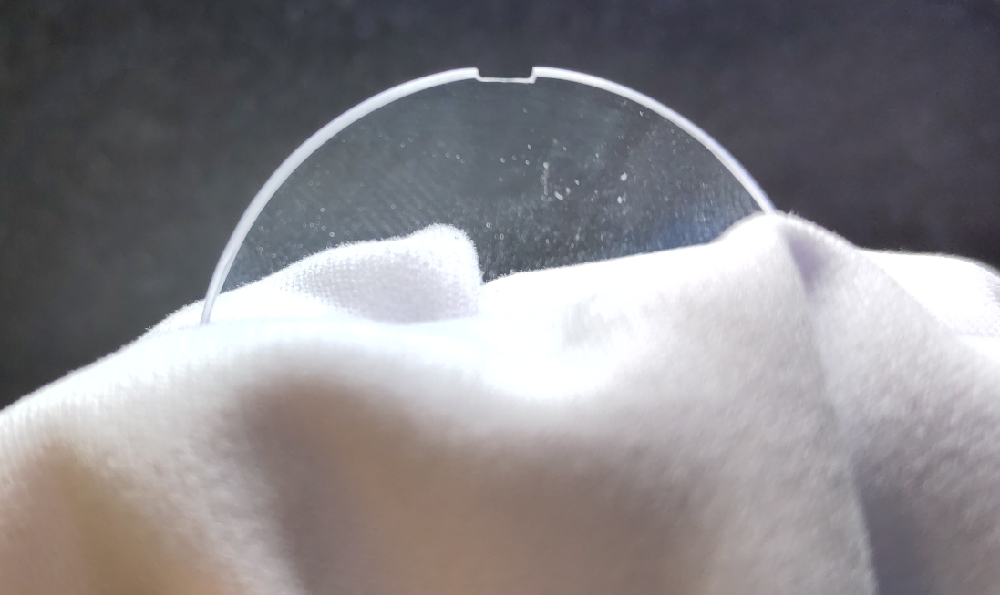

## Assembly

### Extra components needed

- 2 x [1x10mm dowel pins](https://www.mcmaster.com/91585A091/)

### Instructions

- After printing, crack off the supports.
- Ream the hinge pin holes on the frame and both temples with a 0.9mm drillbit, then as little as possible with a 1.0mm drillbit. Be careful when you insert the drillbits: the axes of the hinges are angled 13° vertically to allow the temples to fold up and fit in a regular glasses case. If you insert the drillbits straight vertically, you will damage the hinges!

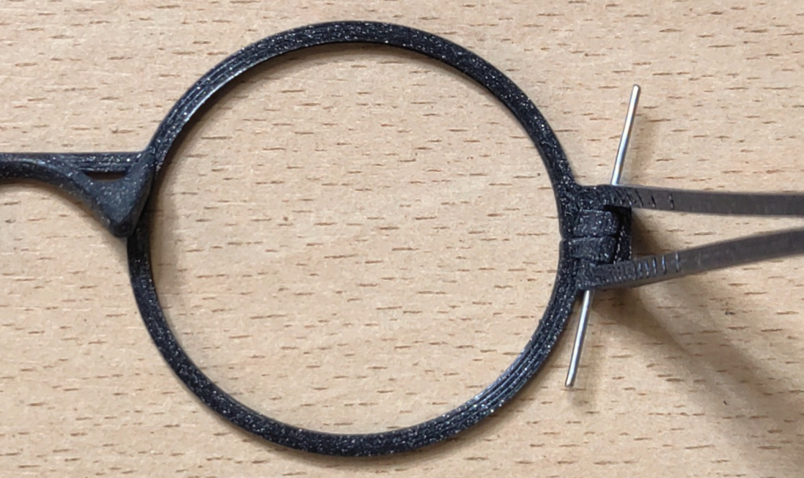
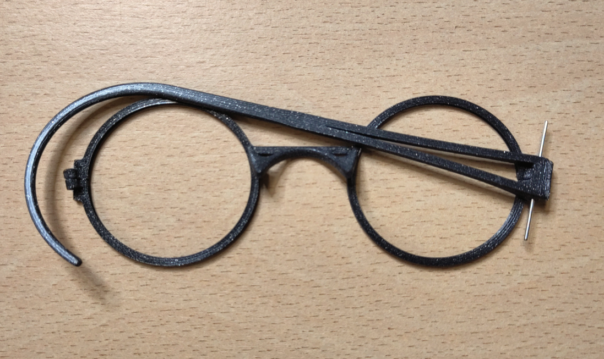

- Insert each lens into its holder with the notch facing the hinge.

- Orient each lens until both halves of the hinge drop into the notch and the hinge closes completely.

- Fit the temples onto the hinges.
- Drive a dowel pin through each temple and hinge to hold everything together.

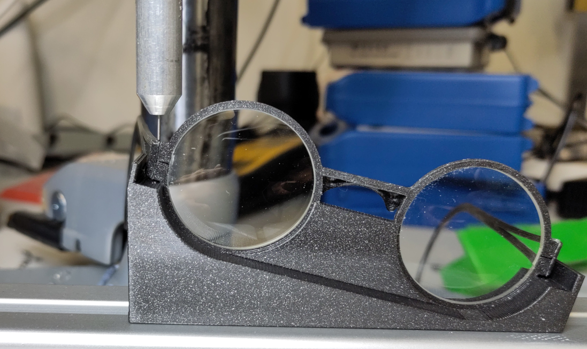

## Customizing

The parts in these FreeCAD model files are designed to create frames that fit me perfectly. But everybody's head is different.

The traditional way to adjust off-the-shelf eyeglasses is to soften and bend the frame and temples. But with 3D-printed frames, it is far better to print them exactly right for you: that way, little to no rework is required after printing new parts.

The frames should naturally drop on the roof of your nose, the temples should drop on the root of your ears and the temple wires should wrap around your ears such that:

- The glasses fit perfectly on your face with **ZERO** internal stress: PLA is quite bendy and these frames are very thin, so it doesn't take much tension to bend them out of shape and compromise the placement of the lenses. The frames should have the exact same shape on your face that they have when resting on a table.
- The glasses stay put on your nose and don't slide down.
- Each lens is perfectly centered on the corresponding eye.
- the lenses don't sit at an angle vertically - i.e. they're normal to your line of sight.

### Adjusting the temples splay

These frames are an older style design. They're copies of my nickel silver frames which I made myself some 20 years ago, themselves copies of vintage 1910 glasses I found at the flea market that I really liked. I believe this style is now called "John Lennon", but it's much older than that.

Frames in that style are much narrower than the wearer's head. The idea is to bring the lenses as close to the eyes as possible to provide a very wide field of view with small lenses and make the temples almost touch the sides of the head over their entire length (very convenient incidentally: you can sleep on your side with your glasses on without damaging them!).

For that reason, the frames are splayed to accommodate the width of your head. In other words, the temples are not parallel but opened up.

To adjust the splay, edit the `Hinge mid profile master sketch` in the temple's FreeCAD model and change the distance between the hinges and the root of your ear and the width of your head at that point:

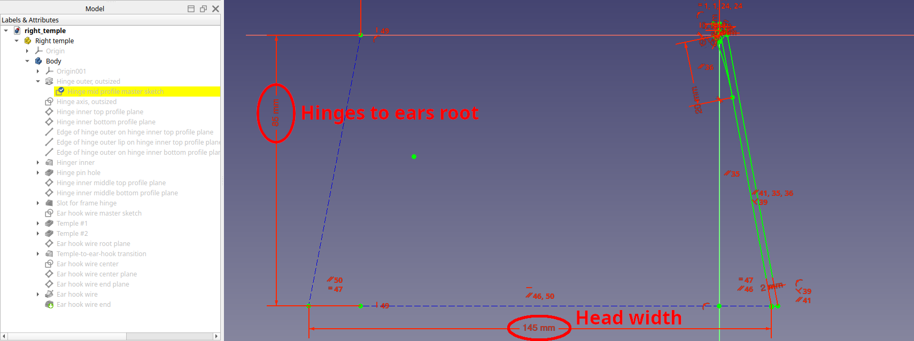

These dimensions aren't critical: they should get the splay angle in the ballpark. The temples should land on your ears without squeezing your head at all. But even if the opening is a few millimeters too narrow, the temple wires are flexible enough to bend a little without deforming the frame at the front.

Still, ideally the temples should only lightly graze the sides of your head.

## Adjusting the temple length, height and hook shape

Edit the `Ear hook wire master sketch` in the temple's FreeCAD model to change the length of the temples, modify the shape of the hooks if they don't wrap around your ears perfectly and adjust the temple drop (or rise if you reverse the dimension) to bring the lenses vertical:

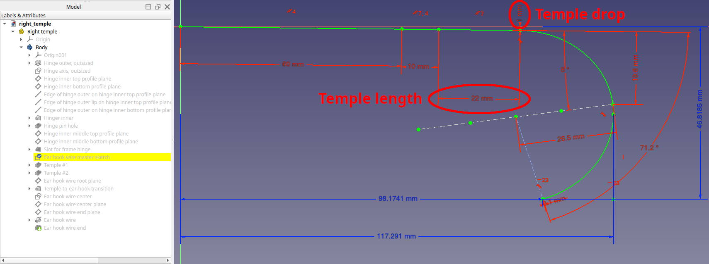

You may - and probably will - want adjust those parameters differently for the right and left temples if your eyes or your ears aren't level, or your ears have different shapes. Most people don't have perfectly symmetrical facial features, so it's perfectly normal.

To determine if the geometry of the left and right temple are correct:

- Don the glasses and let them sit on your nose and ears naturally.
- If a hook pulls on the back of your ear, the temple on that side is too short.
- If you pull gently on a temple and let go of it and that side of the frame stays low on your nose, the temple on that side is too long.
- If the end of a wire digs into the bottom of your ear, the wire hook on that side is too narrow.
- If the wire only rests on the top half of your ear and doesn't touch the bottom, the wire hook on that side is too wide.

Look straight ahead:

- If the frame looks like an unbroken circle and it looks like you're looking through a single hoop, the temple lengths and drops are dead-on.
- If the circle looks broken but the two halves look like they're the same diameters, you'll need to increase the drop on the side the half-circle appears lower.
- If the circle looks broken but the two halves look like they're at the same level but different diameters, you'll need to increase the length of the temple on the side the half-circle looks larger.

Those adjustments are sometimes mere millimeters and are done by trial and error - i.e. print, test for fit, re-print, re-test for fit... until the glasses fit perfectly and feel really comfortable.

It's a bit tedious but it's a one-off job: once it's done, you'll get perfectly-fitting glasses out of your printer each and every time.

## Adjusting the nose bridge

If the nose bridge is too narrow, it will feel like it's digging into the sides of your nose when wearing the glasses for a long time. If it's too wide, it will feel heavy on top of your nose over time.

You can adjust the shape of the bridge by editing the `Nose bridge profile` sketch in the frame's FreeCAD model. Unfortunately, this sketch has a lot of dependencies in other features of the model, and it's designed to merge perfectly with the decorative straight bridge at the front. So if you modify it too much, it will probably break the model. So some knowledge of modelling with FreeCAD is required to successfully alter the shape of the nose bridge so the model resolves correctly.

## Adjusting the lens holders' diameters

Depending on your particular printer and how the lens manufacturer edged the lenses exactly, the lenses may not fit perfectly inside the lens holders. You can modify the diameters of the lens holders by editing the `Lenses holder master sketch` in the frame's FreeCAD model:

The lens holders are elliptical and are nominally 40mm and 38mm in diameter. If the lenses fit loosely, reduce both diameters in steps of 0.1mm, reprint and retest for fit. If they fit too tight, increase both diameters similarly. Don't increase the diameters more tham 0.2mm to avoid compromising the frame's rigidity.

## Custom case

This case is custom-made for these glasses. It's designed to hold them by the edge of the frame only, without the lenses ever touching any part of the case, so the case doesn't need to be padded with soft material of any kind to prevent scratching:

The case is thick and very stiff, and the hinge is very solid. The case is held closed with 4 neodymium magnets. The lid is designed to pinch the edge of the frame when the case is closed, to lock the glasses in place and prevent them from shifting inside.

https://github.com/user-attachments/assets/2d8ead8f-aeec-490b-bac6-e63e706328ba

### Files

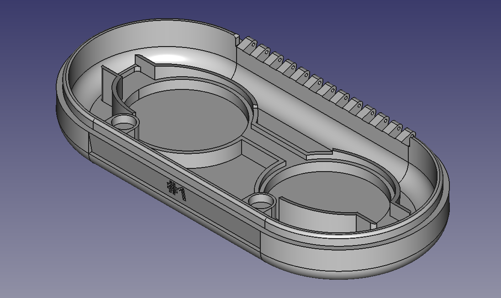

- [FreeCAD model for the bottom of the case](case_bottom.FCStd)
- [3MF model for the bottom of the case](case_bottom.3mf)

- [FreeCAD model for the top of the case](case_top.FCStd)
- [3MF model for the top of the case](case_top.3mf)

### Assembly

#### Extra components needed

- 4 x [8x3mm neodymium magnet disks](https://uk.farnell.com/eclipse-magnetics/n825/neodymium-disc-magnet-8-x-3mm/dp/3376635)
- 79mm of [1mm piano wire](https://www.modelscenerysupplies.co.uk/piano-wire-1mm)

#### Instructions

- Epoxy 2 magnets in the magnet holders inside each half of the case. Pay attention to the orientation: opposing magnets should attract, not repel each other!
- Let the epoxy cure fully.
- Line up the top and bottom halves of the case.
- Slide the piano wire all the way through the hinge.

#### Customizing

The FreeCAD models for the bottom and top halves of the case include engraved-style lettering on the front edge. By default, the top half says "Glasses" and the bottom half says "#1". You can configure them to say whatever you want, like put your name on the case for example. To do so, edit the ShapeString in the model(s) you wish to change:

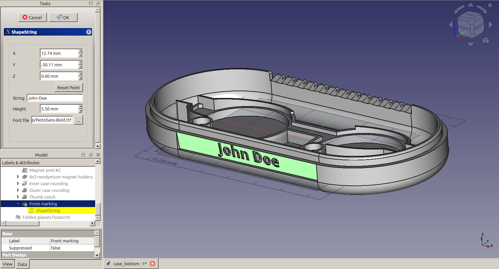

## Clip-on shades for round 38.8mm-diameter lenses

Attachment to turn your glasses into sunglasses.

These shades are designed to take round tinted lenses that are 38.8mm in diameter and 1.5mm thick. Specifically, they're designed for lenses harvested from cheap [Cailap Pouta sunglasses for children](https://cailap.com/fi/tuote/aurinkolasit/kids-aurinkolasit-pouta/).

I found several pairs of those half-price in an airport gift shop, so I bought all of them, kept the lenses and threw away the cheap plastic frames. If you find other suitable cheap donor sunglasses, modify the FreeCAD model accordingly.

### Files

- [FreeCAD model for the clip-on shades for round 38.8mm-diameter lenses](clip-on_shades_for_round_38.8mm_diam_lenses.FCStd)
- [3MF model for the clip-on shades for round 38.8mm-diameter lenses](clip-on_shades_for_round_38.8mm_diam_lenses.3mf)

## Clip-on shades with novelty mesh lenses

Attachment to turn your glasses into sunglasses of sorts. The "lenses" are in fact very fine 3D-printed mesh, so vision through them is not perfect. But it's plenty good enough to do sports for example. Their main advantage is that they don't require real lenses and they're almost free.

*Note: these shades aren't eye-safe. They'll let UV light through. If your regular, clear lenses don't have a UV coating, please glue a layer of UV-filtering material on the inside!*

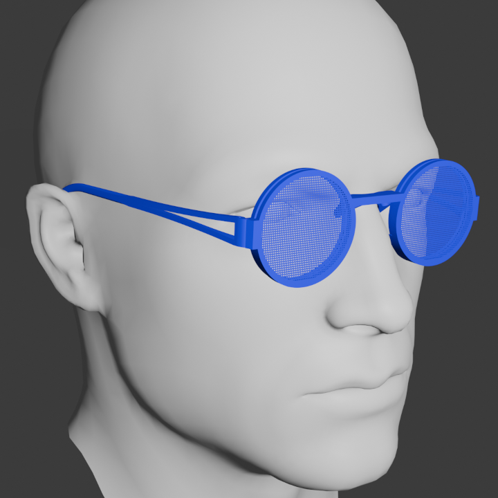

### Files

- [FreeCAD model for the clip-on shades with novelty mesh lenses](clip-on_shades_with_novelty_mesh_lenses.FCStd)
- [3MF model for the clip-on shades with novelty mesh lenses](clip-on_shades_with_novelty_mesh_lenses.3mf)

The clip-on shades with novelty mesh lenses are designed to be printed with a 0.4mm nozzle at a 0.1mm layer height, including the first layer.

## Custom case for the clip-on shades

This case is custom-made for the clip-on shades. Like the eyeglasses case, it's designed to hold them by the edge of the frame only, without the lenses ever touching any part of the case, so the case doesn't need to be padded with soft material of any kind to prevent scratching:

The case is thick and very stiff, and the hinge is very solid. The case is held closed with 4 neodymium magnets. The lid is designed to pinch the edge of the frame when the case is closed, to lock the clip-on shades in place and prevent them from shifting inside.

https://github.com/user-attachments/assets/a3490ee9-8b56-42ed-8718-a661a9f8ea53

### Files

- [FreeCAD model for the bottom of the clip-on shades case](clip-on_shades_case_bottom.FCStd)
- [3MF model for the bottom of the clip-on_shades_case](clip-on_shades_case_bottom.3mf)

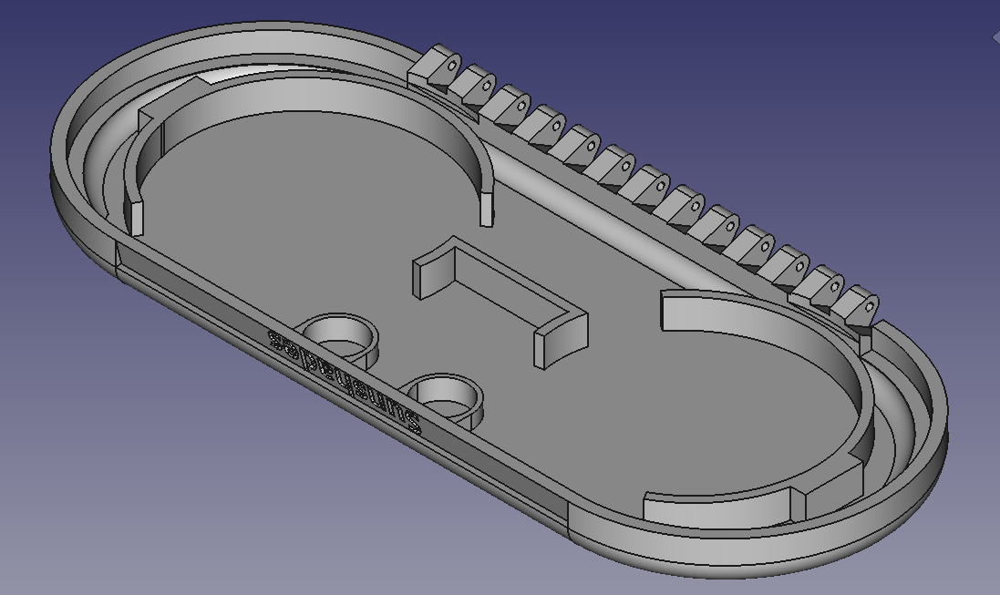

- [FreeCAD model for the top of the clip-on shades case](clip-on_shades_case_top.FCStd)
- [3MF model for the top of the clip-on shades case](clip-on_shades_case_top.3mf)

### Assembly

#### Extra components needed

- 4 x [8x3mm neodymium magnet disks](https://uk.farnell.com/eclipse-magnetics/n825/neodymium-disc-magnet-8-x-3mm/dp/3376635)
- 78mm of [1mm piano wire](https://www.modelscenerysupplies.co.uk/piano-wire-1mm)

#### Instructions

- Epoxy 2 magnets in the magnet holders inside each half of the case. Pay attention to the orientation: opposing magnets should attract, not repel each other!
- Let the epoxy cure fully.
- Line up the top and bottom halves of the case.
- Slide the piano wire all the way through the hinge.

#### Customizing

The FreeCAD models for the bottom and top halves of the clip-on shades case include engraved-style lettering on the front edge. By default, the top half says "Sunshades" and the bottom half says "#1". Like the eyeglasses case, you can configure them to say whatever you want by editing the ShapeString in the model(s) you wish to change.
