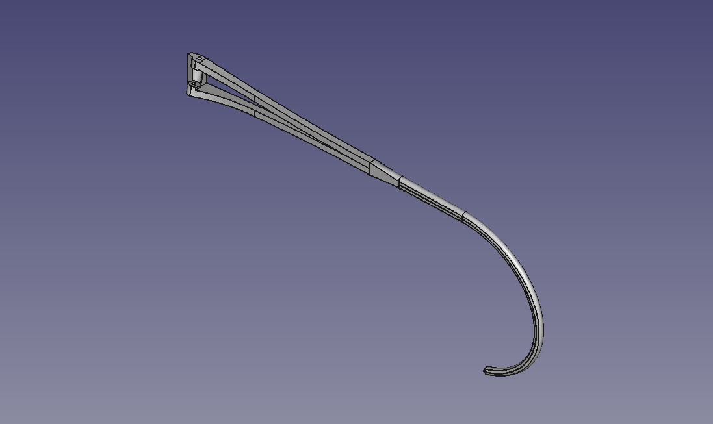
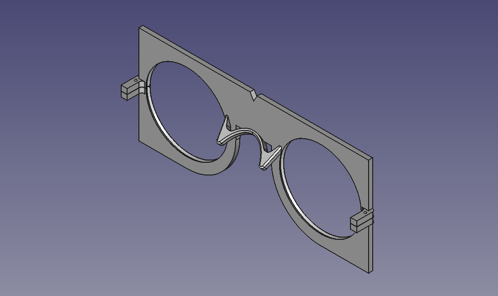

# 3D-printed eyeglasses
### Version 1.0

Those are the CAD files for the frames of the spectacles I wear every day. When I break the frames, or if I want a new color for a bit of diversity, I simply print new frames and reuse the lenses.

* [Files](#Files)
* [Explanation of the registration tabs](#Explanation-of-the-registration-tabs)
* [Printing](#Printing)
* [Ordering lenses](#Ordering-lenses)
* [Assembly](#Assembly)

## Files

### Frames proper

Final frames in which the lenses are mounted. The lens holders feature lens registration tabs in the V-grooves at the split hinges (see below).

- [FreeCAD model for the frame](frame.FCStd)
- [3MF model for the frame](frame.3mf)

- [FreeCAD model for the right temple](right_temple.FCStd) (the left temple is the mirror)
- [3MF model for the right temple](right_temple.3mf) (the left temple is the mirror)

### Template for the lens manufacturer

This template is supplied to the lens manufacturer: the lens holders have the same geometry as the final frames but the template is square and stiffer to facilitate mounting in the [lens edging machine](https://youtu.be/dKXUWH8gQLU), the V-groove is slightly deeper than the V-groove in the final frames and the registration tabs are absent to avoid snagging on the edging machine's tracer.

- [FreeCAD model for the edging machine template](template_for_lens_edging_machine.FCStd)
- [3MF model for the edding machine template](template_for_lens_edging_machine.3mf)

- [FreeCAD model for the edging machine template's fake hinges' locking piece](template_for_lens_edging_machine-hinge_lock.FCStd) (2 needed per template)
- [3MF model for the edging machine template's fake hinges' locking piece](template_for_lens_edging_machine-hinge_lock.3mf) (2 needed per template)

### Additional details for the lens manufacturer

A few details the lens manufacturer needs to choose the grinding wheel with the correct bevel profile ("hide-a-bevel"-type bevel, 120° angle) and the width and position of the lens registration tabs if you want them to file it for you - and they agree to do it of course:

## Explanation of the registration tabs

The final frames feature lens registration tabs around the split hinges that interrupt the V-grooves. Those tabs orient the lenses correctly, which is important for astigmat lenses particularly. In this frame design, they also help lock the frame closed.

The tabs are required because the lenses are almost round. They provide a positive mechanical stop to prevent the lenses from shifting and turning in the lens holders, but they require filing a 3mm-wide notch in the lenses' bevel.

This type of lens registration is almost never used in round glasses because the frame itself is usually made of a material strong enough to clamp the lenses solidly in place, or the lenses are glued in place. Also, they're difficult to manufacture with traditional machining methods.

Those 3D-printed glasses provide very little clamping force, and glue isn't ideal to routinely and quickly install the lenses into new frames without damaging them. But it's trivially easy to print the registration tabs inside the V-grooves with a 3D printer.

Notching the bevel of the lenses is a one-off job, so this registration solution is more desirable if you want to change frames often. But it does require a square needle file, and more importantly, being handy with one. And it does require a small vise with rubber jaws, covering the lenses with scotch tape to avoid scratching them when they're clamped in the vise, and working up the nerves to files through your brand new, multi-hundred-dollar lenses if your prescription is very special.

If you don't think you can do it, point your lens manufacturer or your local optician to this page and ask them if they can do it for you. The lens manufacturer probably won't have time for this, but your local optician most certainly will if you order through them - but for a price of course. But again, it's a one-off job and after that, your new frames will always be free and you'll be able to mount the lenses yourself at home in a couple of minutes 🙂

## Printing

You can print the frames in any material you want, even PLA. Prefer low layer heights and print at lower speeds to get better details and more accuracy for the hinge pin holes and the V-groove profile. 0.2mm works, but 0.15mm or even 0.10mm is better. Print the lens holder front face down and the temples outer face down, so the visible surfaces when you wear the glasses look the smoothest and nicest.

## Ordering lenses

- Print the template and 2 fake hinge locking pieces.
- Split the hinges with an X-Acto knife or a razor blade.
- Close each hinge with a locking piece and secure it with a small piece of 1mm piano wire or similar.
- Send the template to the lens manufacturer or give it to your optician along with your prescription and tell them you want to receive the lenses mounted with the proper orientation in the lens holders with the 3 alignment dots marked on each lens! This is very important if you want to notch the bevels yourself. Otherwise ask the lens manufacturer or the optician to do it for you: they'll know what to do.

## Notching the lenses

- Insert the lenses in the template if they didn't come back from the lens manufacturer or the optician already mounted in it.
- Lightly squeeze the fake hinges with your fingers and line up all 6 alignment dots on the lenses.
- Close the fake hinges with the locking pieces.
- Ensure the lenses are positioned properly by placing the template on your nose like real glasses and ensuring you can see well through the lenses. Don't notch the lenses unless your vision is perfect at this point!
- With a thin sharpie, mark the location of the split hinge on each lens, front and back.
- Remove the lenses from the template and draw a line between the two marks on each lens, across the thickness of the lens, straddling the bevel.
- Cover the lenses in scotch tape to avoid damaging them in the vise.
- File a 3mm-wide notch into the bevel centered on the line on each lens. Don't file any deeper than the height of the bevel, otherwise the notch will be visible when the lens is mounted in the frame!

## Assembly

### Extra components needed

- 2 x [1x10 mm dowel pins](https://www.mcmaster.com/91585A091/)

### Instructions

- After printing, crack off the supports.
- Insert each lens into its holder with the notch facing the hinge.
- Orient each lens until both halves of the hinge drop into the notch and the hinge closes completely.
- Fit the temples onto the hinges.
- Drive a dowel pin through each temple and hinge to hold everything together.
